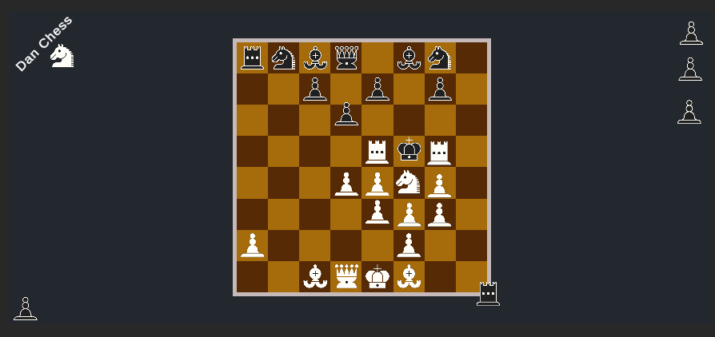
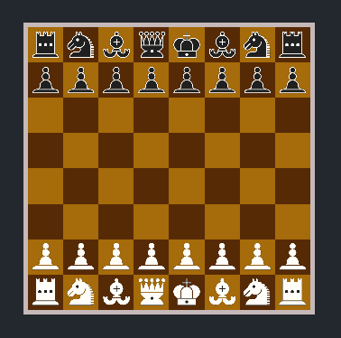

# Dan Chess

Learning Unity and chess.

Basically a rebuild of https://github.com/SebLague/Chess-AI

## Features

- Board Themes
- Piece Themes
- Read from [FEN](https://en.wikipedia.org/wiki/Forsyth%E2%80%93Edwards_Notation)

## Tech

- C#
- Unity 2020

## Resources

- https://www.chessprogramming.org/Main_Page
- https://github.com/SebLague/Chess-AI
- https://web.archive.org/web/20071026090003/http://www.brucemo.com/compchess/programming/index.htm
